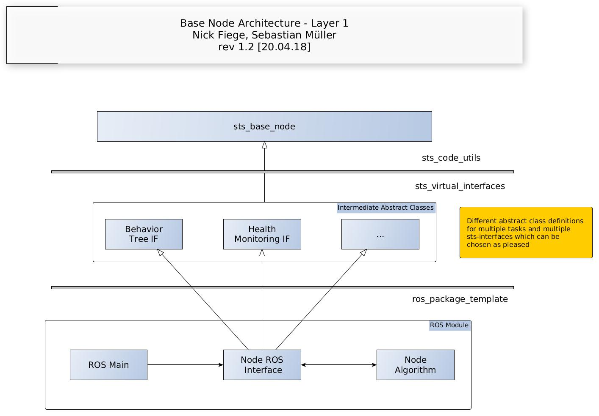

# sts_virtual_interfaces

## Overview

This is a ROS metapackage containing all virtual interface implementations extending our base node functionalitys and a package containing all important ROS message, service and action types.

- sts_health_monitoring_interface

- sts_behavior_tree_interface

- sts_virtual_interface_msgs
  ​

## Installation

### Dependencies

- [Robot Operating System (ROS)](http://wiki.ros.org) (middleware for robotics),

- sts_code_utils
   ​

### Building

To build from source, clone the latest version from this repository into your catkin workspace and compile the package using

	cd catkin_ws/src
	git clone --recurse-submodules -j8 git@10.10.1.190:al_SW_Team/sts_virtual_interfaces.git
	cd ../
	catkin build
	

## Documentation

### System Desciption

All interfaces are an extension of our base node functionalitys. These create a classical diamond shaped class hierarchy. Interfaces are specified for a generalized and consistent usage of specific sts use cases.

