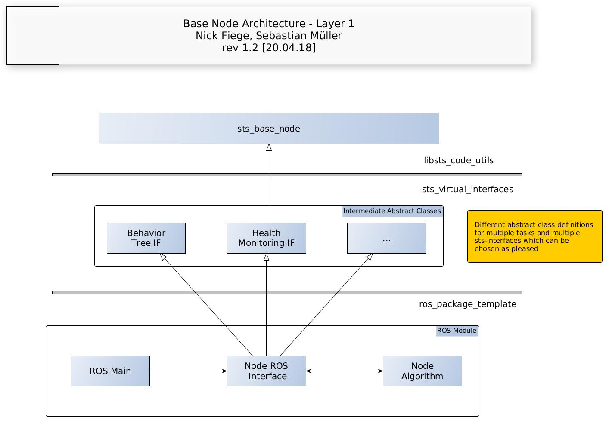

# sts_behavior_tree_interface

## Overview

This module is still in development.

It provides an interface implementation to connect nodes with sts_base_node heritage to an implementation of the behavior_tree_core package. It allows for a user created number of publish, service and action communications between the user node and the behavior tree.

### Publications

See the  planning_and_control_knowledge repo in gitlab.
## Installation

### Installation from Packages

#### Dependencies

- [Robot Operating System (ROS)](http://wiki.ros.org) (middleware for robotics),

- sts_code_utils

- sts_behavior_tree

#### Building

To build from source, clone the latest version from this repository into your catkin workspace and compile the package using

	cd catkin_ws/src
	git clone git@gitlab_al.streetscooter.eu:al_SW_Team/sts_virtual_interfaces.git
	cd ../
	catkin build
	

## Usage
See documentation.

## Bugs & Feature Requests

Please report bugs and request features using the [Issue Tracker](http://gitlab_al.streetscooter.eu/al_SW_Team/sts_virtual_interfaces/issues).


## Documentation

### General
Manage ros communication channels with the following API.

**API:**

    bool createBtIfCom(std::string id, sts_bt_types::COMTYPE type, bool errorDefault, sts_bt_types::callbackFct userCallback);
    bool createBtIfCom(std::string id, sts_bt_types::COMTYPE type, bool errorDefault);

    bool deleteBtIfCom(std::string id);
    
    void setFrequency(std::string id, double frequency);

    void setDefaultBtIfComResult(std::string id, bool b);
    bool getDefaultBtIfComResult(std::string id);

    void setCallbackFct(std::string id, sts_bt_types::callbackFct cb);

**Argument description:**

* **id:** Topic name this communication channel is supposed to run on
* **type** (sts_bt_types::TOPIC, sts_bt_types::SERVICE, sts_bt_types::ACTION): Defines the type of communication to set up
* **errorDefault:** Sets the default value which is sent if no callbacks are registered (**FUTURE**: Also in case of error if some kind of heath monitoring is involved)
* **userCallback:** Defines the callback function the user registers with the communication channel
	* Prototype: ```void NodeInterface::Callback(sts_bt_types::sts_bt_param* resultPtr)```
	
**sts_bt_param class:**
Container class for the user to 
1. receive arguments in sts_bt_args class
2. send results to the interface via sts_bt_result class

```
class sts_bt_param
sts_bt_args* getArgsPtr();
sts_bt_result* getResultPtr();

class sts_bt_args
bool& getPreemptRequestReference();

class sts_bt_result
bool getResult();
void setResult(bool);
```
**Implementation details for publish communication:**
1. Set the wait time[s] between publish calls with ```this->setFrequency(std::string id, waitTime);``` outside the callback function.
2. Set the condition variable the tree needs to the resultObject inside the callback function.

NOTE: In the current implementation the publisher only sends information on the topic if the set value in the resultObject differs from the last cycles.

**Implementation details for service communication:**
1. Do your thing with the information that you have been called by  the behavior tree.
2. Set the condition variable the tree needs to the resultObject.

Notice that service callbacks are supposed to return fast. **DONT** block the tree execution.

**Implementation details for action communication:**

Since actions run asynchronously there are no time requirements towards these callbacks. 

Instead the user has to make sure```resultPtr->getArgsPtr()->getPreemptRequestReference()``` gets evaluated regularly if there is a preempt request for this running action. In case there is a request the user has to interrupt the running action, clean up and return from the callback. The action is only successfuly halted if the callback returns. 

### Example
Create 3 different communication channels: A publisher, service and action. Do some work in the callbacks and manipulate the resultObject to send this information to the interface.
```
this->createBtIfCom("bt_topic", sts_bt_types::TOPIC, false, std::bind(&BehaviorTreeNodeInterface::publishCallback, this, std::placeholders::_1));
this->setFrequency("bt_topic", 0.2);

this->createBtIfCom("bt_service", sts_bt_types::SERVICE, false, std::bind(&BehaviorTreeNodeInterface::serviceCallback, this, std::placeholders::_1));
this->createBtIfCom("bt_action", sts_bt_types::ACTION, false, std::bind(&BehaviorTreeNodeInterface::actionCallback, this, std::placeholders::_1));
    
void NodeInterface::publishCallback(sts_bt_types::sts_bt_param* resultPtr)
{
    resultPtr->getResultObj()->setResult(this->getCurrentResult());
    return;
}

void NodeInterface::serviceCallback(sts_bt_types::sts_bt_param* resultPtr)
{
    resultPtr->getResultObj()->setResult(this->getCurrentResult());
    return;
}

void NodeInterface::actionCallback(sts_bt_types::sts_bt_param* resultPtr)
{
    if (resultPtr->getArgsObj()->getPreemptRequestReference() == false)
       resultPtr->getResultObj()->setResult(this->getCurrentResult());
    else
       resultPtr->getResultObj()->setResult(this->getCurrentResult());

    return;
}

```

### Future Work:

* Option for the publisher to always broadcast the last value. Not just in case there has been a change in value.
* Review the implementation for necessary communication timeouts and error behavior when a general health monitoring is implemented and connected.

### Additional Information:




